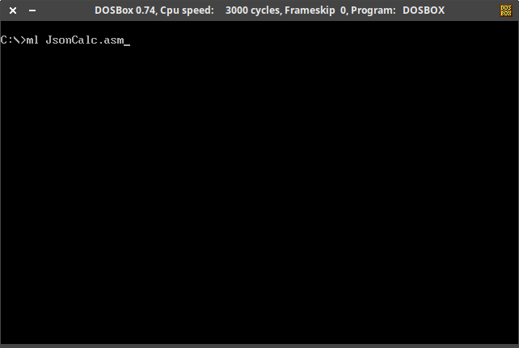
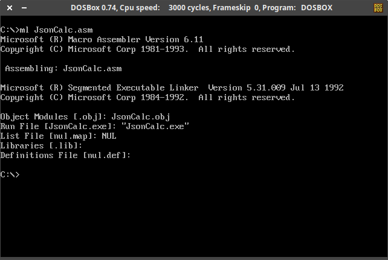
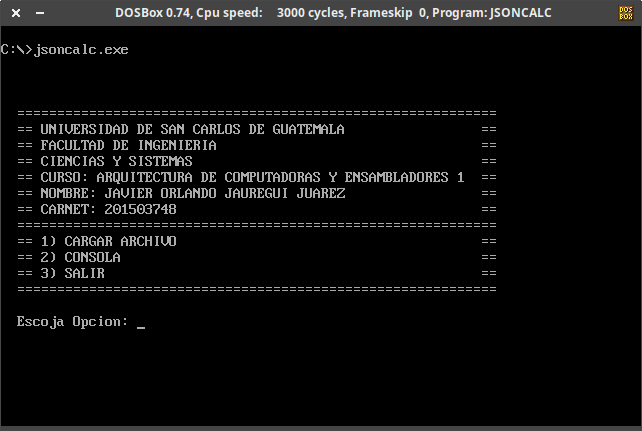
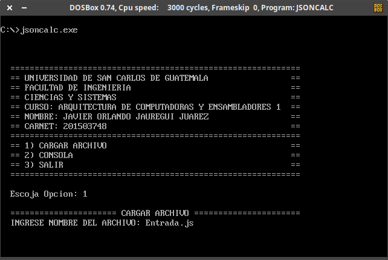
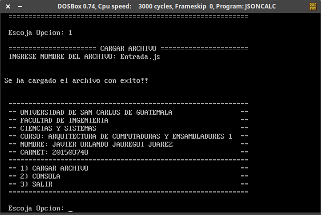
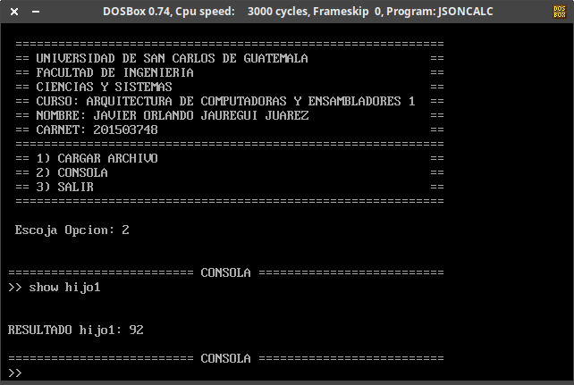

# JsonCalc
Programa desarrollado en MASM16 para realizar operaciones aritméticas y estadísticas sencillas contenidas en un archivo de entrada tipo **JSON**. En el archivo [Entrada.js](Entrada.js) se encuentra un ejemplo de archivo de entrada con la sintaxis utilizada para la especificación de las operaciones.

## :information_source:  Información General

Este programa fue realizado como parte del curso de **Arquitectura de Computadoras y Ensambladores 1** de la Universidad San Carlos de Guatemala. Los requerimientos utilizados para su elaboración pueden ser encontrados en el documento [Enunciado_Practica5.pdf](Enunciado_Practica5.pdf).

### 📋 Pre-requisitos

Para la ejecución de este programa se utiliza el emulador [DOSBox](https://www.dosbox.com/) en su versión 0.74-3 y el ensamblador **MASM16** para la generación del ejecutable.

### 🔧 Generación del ejecutable

Para la generación del ejecutable abrimos en **DOSBox** la ubicación donde se encuentra el código de fuente [JsonCalc.asm](JsonCalc.asm) e ingresamos el comando `ml jsoncalc.asm`:

Después de realizar lo anterior, se generará el archivo ejecutable JsonCalc.exe, el cual se ejecuta en **DOSBox** para poder hacer uso del programa:

### :sparkler: Uso

Para hacer uso del programa es necesario cargar un archivo de entrada por medio de la **opción 1** en el menú principal e ingresar el nombre del archivo entrada **(el archivo de entrada debe estar en la misma ubicación que el ejecutable)**:

Si el archivo de entrada es correcto se mostrará el mensaje **"Se ha cargado el archivo con exito!!"**:

Una vez cargado el archivo, se ingresa a la **opción 2** para acceder a la consola donde se podrá ingresar los comandos para obtener los resultados del archivo de entrada:

Consultar [Enunciado_Practica5.pdf](Enunciado_Practica5.pdf) para ver todas las funcionalidades del programa y su uso.
